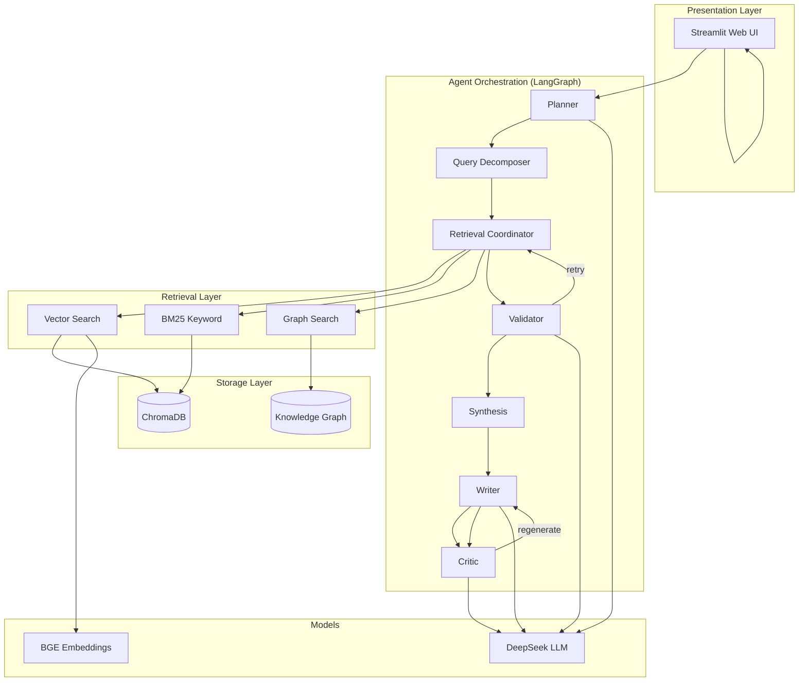
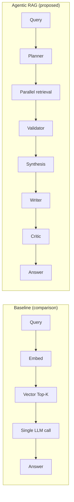

# Thesis Architecture & Innovation Points

Copy diagrams to [Mermaid Live Editor](https://mermaid.live) and export as PNG for your thesis.

---

## Figure 1 — System architecture

---

## Figure 2 — Baseline vs proposed pipeline

---

## Innovation points (thesis text)

### 1. Hierarchical multi-agent orchestration

Unlike fixed pipelines, the system selects strategies (simple / multi-hop / graph) via a **Planner** and decomposes complex queries before retrieval.

### 2. Hybrid retrieval swarm

**Vector**, **BM25**, and **graph** retrieval run in parallel; **Synthesis** fuses and deduplicates evidence before generation.

### 3. Dual quality control

- **Validator**: retrieval sufficiency, optional re-retrieval.  
- **Critic**: answer quality loop with regeneration.

### 4. GraphRAG for relational questions

Entity–relation paths support questions that pure vector search cannot answer reliably.

### 5. Reproducible baseline comparison

The same index and LLM power a **Naive RAG** baseline, enabling fair comparison in experiments (RAGAS metrics + case studies).

---

## Suggested figure captions (English)

- **Figure 4-1** Overall architecture of the proposed Agentic RAG system.  
- **Figure 4-2** Comparison between Baseline naive RAG and the proposed multi-agent pipeline.  
- **Table 5-1** Average RAGAS scores on the thesis test set (Baseline vs Agentic).

Translate captions to Chinese if your thesis is written in Chinese.
